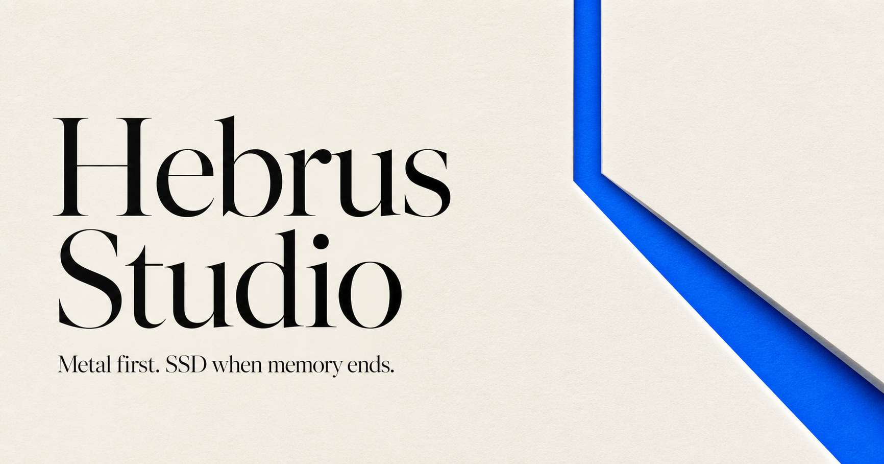
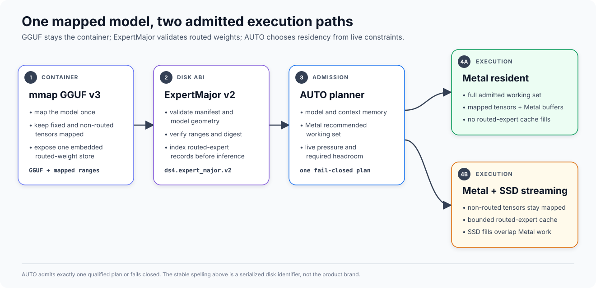

<p align="center">
  
</p>

# Hebrus

**Local inference built first for Apple Metal and SSD streaming.**

Hebrus is a focused inference engine for running a small, explicitly qualified
set of large mixture-of-experts models on Apple Silicon. It combines mmap-backed
GGUF loading, an embedded ExpertMajor v2 routed-weight store, Metal execution,
and adaptive SSD streaming so unified memory is a performance tier rather than
the only capacity boundary.

[Quick start](#quick-start) · [Supported models](#supported-models) ·
[Measured results](#measured-results) · [Documentation](#documentation) ·
[Contributing](CONTRIBUTING.md)

> [!NOTE]
> **Hebrus** is the public engine name and canonical executable namespace.
> The engine is published at
> [`andreaborio/hebrus`](https://github.com/andreaborio/hebrus), with
> [`Hebrus Studio`](https://github.com/andreaborio/hebrus-studio) as its
> companion macOS application. Durable `ds4` and `DSBox` identifiers remain
> only where changing their bytes would break model, application, or user-data
> compatibility; see
> [ADR 0005](docs/adr/0005-hebrus-naming-and-compatibility-boundary.md).

> [!IMPORTANT]
> Hebrus began as a fork of
> [`antirez/ds4`](https://github.com/antirez/ds4) and retains substantial
> core-engine implementation, Git history, and design work from that project.
> The fork has since diverged toward Apple Metal, embedded ExpertMajor storage,
> and SSD-first execution. This attribution does not imply endorsement by or an
> official partnership with the upstream maintainer. See
> [Acknowledgments](ACKNOWLEDGMENTS.md) and
> [Third-party notices](THIRD_PARTY_NOTICES.md) for the precise source scopes.

## What Hebrus is for

Hebrus is designed around one practical question: how effectively can large
MoE models run locally when Metal and the SSD are treated as one coordinated
memory system?

- **Metal-first inference.** Production model execution targets Apple Metal.
- **SSD streaming as a first-class path.** Routed experts can be cached and
  streamed without keeping the complete model in unified memory.
- **Hardware-aware AUTO policy.** Residency and cache plans use model geometry,
  context memory, Metal's working-set recommendation, and live memory pressure.
- **One validated routed-weight container.** Supported artifacts embed the
  checksummed `ds4.expert_major.v2` store directly in GGUF.
- **Narrow support, explicit failure.** Unsupported model families, old stores,
  sidecars, and unqualified backend combinations fail closed instead of taking
  an untested fallback.
- **Evidence before claims.** Correctness and performance decisions are tied to
  exact commits, model hashes, hardware, prompts, memory state, and context
  frontiers.

Hebrus is not a general GGUF runner. Arbitrary community GGUFs are not expected
to load, even when their model family name looks compatible.

## Supported models

The current production contract is Apple Silicon + Metal + embedded
ExpertMajor v2. AUTO is the normal startup mode.

> Published artifact filenames carrying the legacy prefix are frozen compatibility
> identifiers tied to existing hashes and manifests. They do not represent the
> current product name; the runtime and user-facing project are Hebrus.

| Model family | Minimum unified memory | Qualified execution | Artifact availability |
| --- | ---: | --- | --- |
| DeepSeek V4 Flash | 64 GiB | AUTO resolving to resident or SSD; explicit modes for qualification | Published ExpertMajor v2 artifact; `download_model.sh deepseek-v2` |
| GLM 5.2 | 64 GiB | AUTO resolving to SSD streaming only; resident requests are rejected | Published ExpertMajor v2 artifact; `download_model.sh glm-v2` |
| Qwen3.6-35B-A3B | 16 GiB for Stable Affine4; 64 GiB for Q2_K_XL Beta | One shared runtime supports exact MLX Affine4 G64 and Q2_K_XL weight profiles. Guarded SSD is qualified for Affine4 at 16 GiB; Q2_K_XL Beta has resident/SSD evidence through 32K, while 262K/full-window qualification remains pending | Stable/recommended Affine4: `download_model.sh qwen-v2`; opt-in Q2_K_XL Beta: `download_model.sh qwen-q2-beta` |

The canonical machine-readable
[Qwen release contract](docs/contracts/qwen-release.json) records the current
Stable artifact as `published`. The release is exactly
`Qwen3.6-35B-A3B-DS4-ExpertMajor-v2-MLX-Affine4-G64.gguf`,
20,808,566,880 bytes, SHA-256
`dd17266185833a9f05531ce366fd7284ddca1ed64aa3dcf06e321e8c72c9ea3d`.
It is pinned to immutable repository revision
`7bf9c3f7f6136aeb2599d75ee61c0cc2f18e2b02`. Its `runtimeCommit`
`73a332fef82a0bcdd567d17e0de17aa004cad85d` is the artifact-format
compatibility floor, not a safety qualification for every hardware tier. A
release runtime must also contain every policy required by the current support
contract; in particular, the 24 GiB pin must advance to the published
allocation-time hardening commit before release. The
older `Qwen3.6-35B-A3B-DS4-ExpertMajor-v2-Q4_K_S.gguf` store is incompatible
with the current runtime and remains `negative-only`, never a download or
inference fallback.

The second admitted Qwen profile is `published-beta`, is not recommended, and
is available only through the explicit `qwen-q2-beta` selector. It is the exact
`Qwen3.6-35B-A3B-DS4-ExpertMajor-v2-Q2_K_XL.gguf` artifact:
12,290,632,032 bytes, SHA-256
`30c22f70aff0f05986b517ee4ad8fef554a1b5aab6971c9ca09f999566d30143`.
Its embedded payload SHA-256 is
`ccc3fbc2405d1dd73f8ac15741b0277514de4f46b80818531297ea9ffa0c6a3c`.
The immutable repository revision is
`bdb363efaeb227bfd702c9145cb224fffa456891`, and the minimum compatible
runtime commit is `42e2fec2a7dbb14a42e7a5612dfec00e33d443ca`.
It is 40.93% smaller than the published Affine4 file and uses the same Qwen
session, attention, Gated DeltaNet, KV, cache, resident, and SSD pipeline.
Only the physical weight decoders differ. The Beta contract has a 64 GiB
minimum and is qualified through exactly 32768 context tokens; it is not
full-window qualified because the near-262K endpoint was not run. `qwen-v2`
therefore deliberately continues to download the Stable Affine4 artifact. See
the
[dual-codec decision](docs/adr/0006-qwen-dual-weight-codecs.md) and the
[Q2_K_XL evidence](docs/benchmarks/2026-07-28-qwen-q2-k-xl-performance-weight.md).

DeepSeek V4 PRO has no qualified runtime artifact in the current contract.
Canonical model files are converter inputs, not inference fallbacks. CPU is a
reference and build-isolation path; CUDA and ROCm are frozen with source absent;
distributed inference is retired.

The authoritative details are in the
[runtime support contract](docs/contracts/RUNTIME_SUPPORT.md).

## Quick start

Requirements:

- Apple Silicon Mac;
- Xcode Command Line Tools;
- enough unified memory for the selected supported family;
- enough SSD space for the exact ExpertMajor v2 artifact.

Build and verify the engine without loading model weights:

```sh
xcode-select --install
git clone https://github.com/andreaborio/hebrus.git
cd hebrus

make -j
./hebrus --build-info
./hebrus --capabilities=json
make model-free-test
```

For a user-local installation that does not require `sudo`:

```sh
make install PREFIX="$HOME/.local"
export PATH="$HOME/.local/bin:$PATH"

hebrus --build-info
```

`make install` copies the five canonical `hebrus*` executables and creates the
five `ds4*` compatibility names as relative symlinks to those files. Package
builders can stage the same layout without touching the host filesystem:

```sh
make install DESTDIR="$PWD/package-root" PREFIX=/usr/local
make uninstall DESTDIR="$PWD/package-root" PREFIX=/usr/local
```

`PREFIX` defaults to `/usr/local`; `BINDIR` may override its `bin` directory.
Uninstall removes only the ten explicit command paths and leaves the directory
and every unrelated file intact. `make install-test` verifies the staged
layout, aliases, capabilities, and uninstall boundary without a model or
privileged access.

For a published DeepSeek V4 Flash artifact on a qualified 64 GiB-or-larger
host:

```sh
./download_model.sh deepseek-v2

./hebrus \
  -m gguf/DeepSeek-V4-Flash-IQ2XXS-w2Q2K-AProjQ8-SExpQ8-OutQ8-chat-v2-imatrix-DS4-ExpertMajor-v2.gguf \
  --ctx 8192 \
  -p "Explain why SSD streaming changes the memory limit for MoE inference."
```

Start the local HTTP server with the same artifact:

```sh
./hebrus-server \
  -m gguf/DeepSeek-V4-Flash-IQ2XXS-w2Q2K-AProjQ8-SExpQ8-OutQ8-chat-v2-imatrix-DS4-ExpertMajor-v2.gguf \
  --ctx 8192
```

The canonical commands are `hebrus`, `hebrus-server`, `hebrus-agent`,
`hebrus-bench`, and `hebrus-eval`. Their `ds4*` counterparts remain symlinks to
the same binaries for compatibility; formats, model filenames, environment
variables, and serialized `DS4` identifiers are not renamed by this bridge.

## How the runtime fits together



1. The engine mmaps the GGUF and validates the embedded
   `ds4.expert_major.v2` manifest, tensor inventory, geometry, ranges, and
   digest before inference.
2. AUTO calculates fixed model and context memory, Metal headroom, live host
   pressure, and the model-specific residency policy.
3. When the complete admitted working set fits, Metal uses full mapped tensors.
   Otherwise, the runtime keeps non-routed state mapped and streams routed
   expert records through a bounded cache.
4. CLI, HTTP server, agent, benchmark, and evaluation frontends share the same
   engine and capability contract.

ExpertMajor v2 is a disk ABI, not a brand label. The tensor identifier
`ds4.expert_major.v2`, storage wire values, published filenames and hashes, and
disk-KV format remain unchanged.

## Measured results

These are current durable measurements from one Apple M5 Pro with 64 GiB of
unified memory. They are not cross-model rankings: artifacts, prompts,
residency modes, and decode lanes differ. Follow the evidence links for exact
commands, hashes, invalidations, and memory telemetry.

| Path | Evidence lane | Measured result |
| --- | --- | --- |
| Qwen3.6 MLX affine4/group-64 | Final shared-runtime resident A/B/B/A, 8K and 32K with 128 decode tokens | Versus tested `main`: +11.20% / +4.22% prefill/decode at 8K and +8.20% / +5.27% at 32K; exact frontier and generated-token evidence at 2K/8K/32K |
| Qwen3.6 Q2_K_XL | Resident 8K and 32K with 128 decode tokens | 874.68 / 66.30 prefill/decode t/s at 8K; cooled two-run 32K mean 584.82 / 43.53 t/s; exact artifact hash, byte-identical evidence, and zero swapout |
| DeepSeek V4 Flash ExpertMajor v2 | 32K prose + 128 decode, Metal SSD | 164.43 prefill t/s and 7.27 decode t/s, with zero swapout. |
| GLM 5.2 ExpertMajor v2 | 32K prose + 128 decode, AUTO resolving to SSD | 44.73 prefill t/s and 1.87 overall decode t/s, with zero swapout. |

Sources:

- [Qwen unified affine AUTO and SSD promotion](docs/benchmarks/2026-07-21-qwen-unified-affine-auto-ssd.md)
- [Qwen Q2_K_XL and shared-runtime decision](docs/benchmarks/2026-07-28-qwen-q2-k-xl-performance-weight.md)
- [DeepSeek and GLM long-context Metal stack](docs/benchmarks/2026-07-20-long-context-metal-stack.md)
- [Benchmark evidence index](docs/benchmarks/README.md)

Performance acceptance requires isolated short, medium, large, and 32K
long-context lanes. Attention, KV, cache, RoPE, allocation, and context changes
also require 65K and 100K. Full-window Qwen publication/release qualification
requires the near-262K endpoint admitted by validated metadata. Q2_K_XL is
published only as an opt-in Beta constrained to its measured 32K boundary; it
does not make a full-window or lower-memory claim. A short-context best is not
substituted for a credible long-context or endpoint claim.

## Documentation

### Start and operate

- [Migration guide](docs/guides/MIGRATING_TO_HEBRUS.md) — install the bridge,
  validate both command identities, move integrations safely, and roll back
  without rewriting models or user data.
- [Runtime support contract](docs/contracts/RUNTIME_SUPPORT.md) — supported
  families, hardware floors, backends, and fail-closed boundaries.
- [Brand compatibility contract](docs/contracts/BRAND_COMPATIBILITY.md) —
  canonical commands, legacy aliases, stable formats, and migration rules.
- [Engine reference](docs/ENGINE_REFERENCE.md) — CLI, server, agent, disk KV,
  tracing, evaluation, and operational details.
- [Metal and SSD policy](GOLD_METAL_SSD.md) — build identity, AUTO residency,
  cache planning, and benchmark gates.

### Models and formats

- [ExpertMajor v2 roadmap](docs/expert-major-v2-roadmap.md)
- [DeepSeek ExpertMajor v2](docs/deepseek-expert-major-v2.md)
- [GLM 5.2 ExpertMajor v2](docs/glm52-expert-major-v2.md)
- [Qwen ExpertMajor v2 Affine4 and Q2_K_XL profiles](docs/qwen-expert-major-store.md)
- [GGUF and quantization tools](gguf-tools/README.md)

### Architecture and evidence

- [Runtime flow diagram](docs/architecture/hebrus-runtime-flow.svg) — accessible,
  versioned view of mmap GGUF, ExpertMajor validation, AUTO admission, and the
  resident Metal or SSD-streaming paths.
- [Code map](docs/architecture/CODEMAP.md)
- [Hebrus naming and compatibility decision](docs/adr/0005-hebrus-naming-and-compatibility-boundary.md)
- [Benchmark methodology and records](docs/benchmarks/README.md)
- [Release checklist](QA_BEFORE_RELEASES.md)
- [Fork/upstream ledger](FORK_NOTES.md)

### Project and community

- [Cross-repository rebrand rollout plan](docs/REBRAND_ROLLOUT_PLAN.md) —
  current engine, Studio, and website status; non-breaking rename order; CI,
  compatibility, repository, release, and launch gates.
- [Hebrus bridge launch-candidate notes](docs/releases/hebrus-bridge-launch-candidate.md) —
  implemented scope, preserved compatibility, release evidence, and external
  gates that remain pending.
- [Contribution guide](CONTRIBUTING.md)
- [Security policy](SECURITY.md)
- [Code of conduct](CODE_OF_CONDUCT.md)
- [Governance](GOVERNANCE.md)
- [Changelog](CHANGELOG.md)
- [Citation metadata](CITATION.cff)
- [Acknowledgments](ACKNOWLEDGMENTS.md) and
  [third-party notices](THIRD_PARTY_NOTICES.md)

## Project status

The engine is beta software; `hebrus-agent` remains alpha. Large-model inference
can create substantial memory pressure and I/O. Follow AUTO, use only exact
qualified artifacts, monitor swap and memory pressure, and do not expose a
local server to untrusted networks without an appropriate security boundary.

The companion desktop application is published as
[`andreaborio/hebrus-studio`](https://github.com/andreaborio/hebrus-studio).
Its compatibility bridge preserves the legacy DSBox bundle ID, data locations,
environment namespace, storage keys, and rollback path so the public rename
does not split existing installations.

## Contributing and security

Read [CONTRIBUTING.md](CONTRIBUTING.md) before opening a change. Contributions
must identify realistic failure modes, run the applicable correctness and
performance gates, and classify whether the work should also be proposed to
`antirez/ds4`.

Do not publish vulnerability details in an ordinary issue. Until a dedicated
private reporting channel is enabled, follow the zero-disclosure contact
procedure in [SECURITY.md](SECURITY.md). Enabling GitHub private vulnerability
reporting remains a pre-launch administrative gate.

## License and credit

The project-level license is [MIT](LICENSE). Bundled or adapted third-party
code retains its own notices and conditions; model weights and datasets are not
granted rights by this repository's software license.

Read [ACKNOWLEDGMENTS.md](ACKNOWLEDGMENTS.md) for engineering provenance and
[THIRD_PARTY_NOTICES.md](THIRD_PARTY_NOTICES.md) for bundled-code notices.
