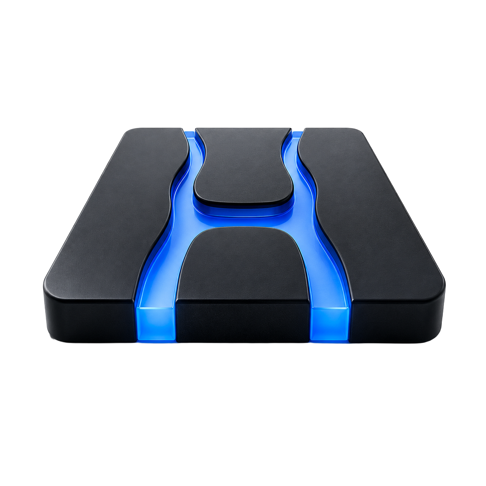

<p align="center">
  
</p>

<h1 align="center">Hebrus</h1>

<p align="center"><strong>Metal-first MoE inference for Apple Silicon, with bounded SSD expert streaming.</strong></p>

<p align="center">
  <a href="https://github.com/andreaborio/hebrus/actions/workflows/ci.yml"></a>
  
  
  <a href="LICENSE"></a>
</p>

Hebrus runs a deliberately small set of qualified mixture-of-experts models:
Qwen3.6-35B-A3B, DeepSeek V4 Flash, and GLM 5.2. It combines mmap-backed GGUF,
a checksummed ExpertMajor v2 store, Apple Metal, and hardware-aware residency
planning so routed experts can move through a bounded SSD cache when the
qualified artifact is larger than unified memory.

[Quick start](#quick-start) · [Supported models](#supported-models) ·
[Measured results](#measured-results) · [Local APIs](#local-apis-and-agents) ·
[How it works](#how-it-works) · [Documentation](#documentation)

> [!IMPORTANT]
> Hebrus is beta software built from source. It supports exact artifacts and
> hardware profiles—not arbitrary GGUFs, model families, or Macs. The runtime
> rejects unsupported combinations instead of silently selecting an untested
> fallback.

## Why Hebrus

- **SSD is part of the runtime, not an emergency fallback.** Routed experts
  use an explicitly budgeted cache while non-routed state remains mapped.
- **AUTO plans against the machine that is actually running.** Admission uses
  model geometry, context memory, Metal's recommended working set, physical
  memory, and live pressure.
- **Support is evidence-bound.** Published claims identify the artifact,
  commit, Mac, memory tier, context, workload, and swap telemetry. Stores are
  embedded and checksummed; unsupported layouts fail closed.

This is a focused engine rather than a general GGUF runner. That narrow scope
is what makes its support contract testable.

## Quick start

The shortest qualified path uses the Stable Qwen3.6 artifact. It needs an
Apple Silicon Mac with at least 16 GiB unified memory, Xcode Command Line
Tools, about 21 GB for the model file, and the official Hugging Face CLI.

Build the engine and inspect its model-free capability document:

```sh
git clone https://github.com/andreaborio/hebrus.git
cd hebrus

make -j
./hebrus --build-info
./hebrus --capabilities=json
```

Install the downloader dependency, fetch the immutable Qwen artifact, and run
an 8K-context prompt:

```sh
python3 -m pip install -U huggingface_hub hf_xet
./download_model.sh qwen-v2

./hebrus \
  -m gguf/Qwen3.6-35B-A3B-Hebrus-ExpertMajor-v2-MLX-Affine4-G64.gguf \
  --ctx 8192 \
  -p "Explain how bounded SSD expert streaming changes MoE inference."
```

`download_model.sh` pins the repository revision and verifies the
20,808,566,880-byte file against its published SHA-256 after download. AUTO is
the normal startup mode; no cache or residency flags are required.

Prefer a desktop interface? [Hebrus Studio](https://github.com/andreaborio/hebrus-studio)
is the companion source repository. Its public binary launch is tracked
separately from this engine.

## Supported models

Every row below requires Apple Metal and the exact embedded
`ds4.expert_major.v2` store. Minimum memory is a qualified floor, not a promise
that every context or workload fits.

| Model | Artifact size | Minimum unified memory | Qualified AUTO path |
| --- | ---: | ---: | --- |
| Qwen3.6-35B-A3B Stable Affine4 | 20.81 GB | 16 GiB | Guarded SSD at 16 GiB through a 128K prompt plus 128 decode tokens; see the contract for higher-memory profiles |
| DeepSeek V4 Flash | 86.72 GB | 64 GiB | Resident or SSD streaming, selected by admission |
| GLM 5.2 | 262.15 GB | 64 GiB | SSD streaming; resident requests are rejected |

Download selectors are `qwen-v2`, `deepseek-v2`, and `glm-v2`. The Qwen Stable
profile is `published`. An opt-in Qwen Q2_K_XL `published-beta` artifact is
available through `qwen-q2-beta`, but it has a 64 GiB floor, is qualified only
through 32768 tokens, and is not the recommended Qwen download.

The [runtime support contract](docs/contracts/RUNTIME_SUPPORT.md) is
authoritative for context frontiers, modes, and negative-only artifacts. The
[machine-readable Qwen release contract](docs/contracts/qwen-release.json)
holds its exact filenames, revisions, byte counts, and hashes.

## Measured results

These are durable measurements from one Apple M5 Pro with 64 GiB unified
memory. Both used a 32K prose prompt, 128 decode tokens, Metal SSD execution,
and recorded zero swapout. Each row links its exact runtime, artifact hashes,
and telemetry.

| Qualified artifact | Artifact size | Prefill | Overall decode | Evidence |
| --- | ---: | ---: | ---: | --- |
| DeepSeek V4 Flash ExpertMajor v2 | 86.72 GB | 164.43 t/s | 7.27 t/s | [Commands, hashes, and telemetry](docs/benchmarks/2026-07-20-long-context-metal-stack.md) |
| GLM 5.2 ExpertMajor v2 | 262.15 GB | 44.73 t/s | 1.87 t/s | [Commands, hashes, and telemetry](docs/benchmarks/2026-07-20-long-context-metal-stack.md) |

These rows show two qualified lanes; they are not cross-model rankings or
performance guarantees for other machines. Qwen records—including the physical
M1 Pro 16 GiB boundary—live in the
[benchmark evidence index](docs/benchmarks/README.md).

## Local APIs and agents

The five frontends share one engine and capability contract:

- `hebrus` — interactive and one-shot CLI;
- `hebrus-server` — local HTTP server;
- `hebrus-agent` — alpha agent frontend;
- `hebrus-bench` and `hebrus-eval` — measurement and evaluation tools.

Start the server with the same Qwen artifact:

```sh
./hebrus-server \
  -m gguf/Qwen3.6-35B-A3B-Hebrus-ExpertMajor-v2-MLX-Affine4-G64.gguf \
  --ctx 8192
```

Then stream an OpenAI-style chat completion:

```sh
curl -N http://127.0.0.1:8000/v1/chat/completions \
  -H 'Content-Type: application/json' \
  -d '{
    "model": "qwen3.6-35b-a3b",
    "messages": [{"role": "user", "content": "Give me three uses for a local MoE model."}],
    "max_tokens": 128,
    "stream": true
  }'
```

The server implements OpenAI Chat Completions, OpenAI Responses, Anthropic
Messages, SSE streaming, and tool calling, with model-specific protocol limits.
For example, Qwen currently supports only `/v1/chat/completions`. See the
[server reference](docs/ENGINE_REFERENCE.md#server) before wiring a client;
inference is serialized through one graph worker and the server binds to
`127.0.0.1` by default.

## How it works


1. Hebrus mmaps the GGUF and validates the embedded ExpertMajor manifest,
   tensor inventory, geometry, byte ranges, and digest.
2. AUTO accounts for fixed model state, context memory, Metal headroom, live
   pressure, and the family-specific residency policy.
3. If the admitted working set fits, Metal uses fully mapped tensors.
   Otherwise, non-routed state stays mapped while routed expert records move
   through a bounded cache.
4. CLI, server, agent, benchmark, and evaluation frontends use the same runtime
   and machine-readable capability document.

`ds4.expert_major.v2` is a stable disk ABI inherited by compatible published
artifacts; it is not the current product name.

## Install and package

For a user-local installation:

```sh
make install PREFIX="$HOME/.local"
export PATH="$HOME/.local/bin:$PATH"
hebrus --build-info
```

Package builders can stage without touching the host filesystem:

```sh
make install DESTDIR="$PWD/package-root" PREFIX=/usr/local
make install-test
make uninstall DESTDIR="$PWD/package-root" PREFIX=/usr/local
```

The canonical commands are `hebrus`, `hebrus-server`, `hebrus-agent`,
`hebrus-bench`, and `hebrus-eval`. Their `ds4*` compatibility names point to
the same binaries. Durable environment variables, serialized identifiers, and
published legacy artifact names remain unchanged where renaming bytes would
break compatibility.

## Current limits

- Apple Silicon + Metal is the production runtime. CPU is for reference and
  model-free isolation; CUDA, ROCm, and distributed inference are not shipped.
- Only the artifacts in the support contract are admitted. Canonical converter
  inputs, old stores, sidecars, and look-alike community GGUFs are rejected.
- Large-model inference creates substantial I/O and memory pressure. Use AUTO,
  keep context inside the qualified frontier, and monitor memory pressure.
- The local server has no built-in authentication and is not a multi-tenant
  security boundary. Do not expose it to untrusted networks without an
  appropriate authenticated layer in front of it.
- The engine is beta; `hebrus-agent` is alpha. Historical tags and benchmarks
  do not extend the current support contract.

## Documentation

### Use Hebrus

- [Engine reference](docs/ENGINE_REFERENCE.md) — CLI, server, agents, disk KV,
  tracing, and evaluation
- [Runtime support](docs/contracts/RUNTIME_SUPPORT.md) — exact models,
  artifacts, hardware floors, and fail-closed boundaries
- [Metal and SSD policy](GOLD_METAL_SSD.md) — AUTO admission, cache planning,
  and benchmark gates
- [Migration guide](docs/guides/MIGRATING_TO_HEBRUS.md) — command aliases and
  rollback without rewriting models or user data

### Understand and verify it

- [Architecture code map](docs/architecture/CODEMAP.md)
- [Benchmark methodology and records](docs/benchmarks/README.md)
- [ExpertMajor v2 roadmap](docs/expert-major-v2-roadmap.md)
- [Qwen storage profiles](docs/qwen-expert-major-store.md)
- [Release checklist](QA_BEFORE_RELEASES.md)
- [Fork and upstream ledger](FORK_NOTES.md)

## Project and provenance

Hebrus began as a fork of [antirez/ds4](https://github.com/antirez/ds4) and
retains substantial implementation, history, and design work from that project.
It has since diverged toward Apple Metal, embedded ExpertMajor storage, and
SSD-first execution. This attribution does not imply endorsement or a
partnership with the upstream maintainer.

The public engine name is Hebrus. Compatibility-owned `ds4` and `DS4`
identifiers remain where changing them would break models, applications, or
user data. The precise boundary is documented in
[ADR 0005](docs/adr/0005-hebrus-naming-and-compatibility-boundary.md) and the
[brand compatibility contract](docs/contracts/BRAND_COMPATIBILITY.md).

Read [ACKNOWLEDGMENTS.md](ACKNOWLEDGMENTS.md) and
[THIRD_PARTY_NOTICES.md](THIRD_PARTY_NOTICES.md) for source-level credit and
bundled-code notices.

## Contributing and security

Start with [CONTRIBUTING.md](CONTRIBUTING.md). Changes must name realistic
failure modes, run the applicable correctness gates, and attach performance
evidence when they change a promoted path. The model-free premerge suite checks
documentation, compatibility contracts, build isolation, installation, and
the supported command surface.

Do not disclose vulnerability details in an issue, discussion, or pull request.
Follow the current private-reporting status in [SECURITY.md](SECURITY.md).

Hebrus is available under the [MIT License](LICENSE). Model weights and datasets
are distributed under their own terms; this repository's software license does
not grant rights to them.
