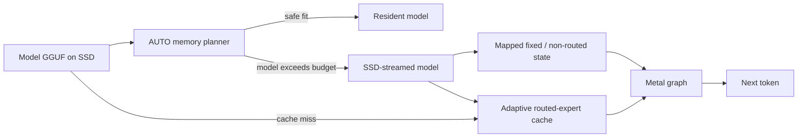

<h1 align="center">DwarfStar</h1>

<p align="center"><strong>ExpertMajor v2 inference for large MoE models on Apple Metal.</strong></p>

<p align="center">
  A transparent research and co-development fork of
  <a href="https://github.com/antirez/ds4">antirez/ds4</a>, focused on Metal,
  adaptive SSD streaming, Apple Silicon systems, and measured experimentation.
</p>

<p align="center">
  <a href="LICENSE"></a>
  
  
  
</p>

<p align="center">
  <a href="#quick-start"><strong>Quick start</strong></a>
  · <a href="#measured-results">Benchmarks</a>
  · <a href="#model-status">Models</a>
  · <a href="https://github.com/andreaborio/dsbox">DSBox</a>
  · <a href="https://github.com/antirez/ds4/compare/main...andreaborio:ds4:main">Upstream diff</a>
  · <a href="#documentation">Documentation</a>
</p>

> [!IMPORTANT]
> This is [`andreaborio/ds4`](https://github.com/andreaborio/ds4), a fork of
> [`antirez/ds4`](https://github.com/antirez/ds4). It does **not** aim to replace
> upstream. The goal is to co-develop DwarfStar: explore complementary hardware
> and model paths here, then propose every general, reproducible improvement back
> to upstream when it clears the correctness and performance bar.

DwarfStar is a small, self-contained inference engine optimized around a narrow
set of very large models. It includes native model loading, prompt rendering,
tool calling, RAM/on-disk KV state, an HTTP server, a coding agent, GGUF tooling,
and correctness and speed tests. It is intentionally **not** a generic GGUF
runner; arbitrary GGUF files are not expected to work.

## Why this fork exists

Upstream DwarfStar provides the core engine and leads the high-memory and
distributed paths. This fork asks a complementary question:

**How far can the same specialized design be pushed on 64 GB and larger Macs,
when the SSD becomes an active model-memory tier?**

The current work concentrates on:

- adaptive Metal residency and routed-expert cache policies across memory tiers;
- SSD streaming that accounts for page cache, wired memory, swap, I/O, and
  throughput together;
- safer model-backed experiments near macOS memory limits;
- one validated ExpertMajor v2 storage contract for DeepSeek, GLM, and Qwen;
- GGUF calibration, incremental quantization, and expert-analysis tooling;
- keeping useful changes small enough to validate and send upstream.

This is primarily a learning and systems-research project. The fork lets work
continue while upstream changes are under review; it is not a parallel rewrite
or a competing inference ecosystem.

## Co-development with upstream

The boundary is explicit and reviewable:

| Change type | Where it belongs |
| --- | --- |
| General, reproducible, backend-safe improvement | Open a PR against [`antirez/ds4`](https://github.com/antirez/ds4) |
| Model- or hardware-specific experiment | Keep it isolated while evidence is incomplete; open an upstream PR too whenever it applies to an upstream-supported path |
| Change that regresses an existing path | Do not promote it; isolate or revise it first |
| Change already solved upstream | Take the upstream implementation and remove the fork delta |

This is mandatory, not aspirational: every fork change applicable to an
upstream-supported path will be opened upstream once its scope, correctness,
and performance evidence are ready. Fork development can continue while that
review is in progress.

Current upstream work includes [#434](https://github.com/antirez/ds4/pull/434)
(quality-score build fix), [#520](https://github.com/antirez/ds4/pull/520)
(GLM streamed-prefill correctness), and
[#528](https://github.com/antirez/ds4/pull/528) (GLM indexed-prefill prepare).
The DeepSeek regression found on the GLM line is tracked in
[#532](https://github.com/antirez/ds4/issues/532). See
[`FORK_NOTES.md`](FORK_NOTES.md) for the status of each fork change and
[`MERGE_LOG.md`](MERGE_LOG.md) for sync history. The same policy is part of
[`CONTRIBUTING.md`](CONTRIBUTING.md). The current `main` delta is always
inspectable in GitHub's
[upstream/fork comparison](https://github.com/antirez/ds4/compare/main...andreaborio:ds4:main).

## Quick start

Requirements: Apple Silicon, Xcode Command Line Tools, an ExpertMajor v2 GGUF,
and enough SSD space for the selected model. The current release and benchmark
baseline is a Mac with at least 64 GiB of unified memory.

```sh
xcode-select --install
git clone https://github.com/andreaborio/ds4.git
cd ds4

make -j8
./ds4 --build-info
./ds4 -m /absolute/path/to/MODEL-DS4-ExpertMajor-v2.gguf --ctx 8192
```

On macOS, AUTO residency keeps the model resident when it safely fits.
Otherwise it selects SSD streaming and derives an expert-cache budget from the
model geometry and live host memory. Force the SSD path only when you need a
controlled run:

```sh
./ds4 -m /absolute/path/to/MODEL-DS4-ExpertMajor-v2.gguf \
  --ssd-streaming --ctx 8192
```

Start the local API with:

```sh
./ds4-server -m /absolute/path/to/MODEL-DS4-ExpertMajor-v2.gguf --ctx 8192
```

## How SSD streaming uses memory



The fixed model state, KV cache, graph scratch, and macOS file-backed cache all
need headroom. The routed-expert cache is the variable tier; making it larger
can help only until it starts displacing the pages and allocations the rest of
the runtime needs.

## Model status

| Model | Location | Status | Current focus |
| --- | --- | --- | --- |
| DeepSeek V4 Flash ExpertMajor v2 | `main` | Supported Apple Metal resident/SSD path | Adaptive SSD streaming and grouped prefill |
| DeepSeek V4 PRO ExpertMajor v2 | offline tooling only | Not runtime-qualified; no release artifact identity | Converter and future per-artifact qualification |
| GLM 5.2 ExpertMajor v2 | `main` | Qualified Apple Metal SSD path; 64 GB minimum | Embedded expert store, grouped prefill, compact DSA KV, 601-record DS4 cache plus adaptive macOS file caching |
| Qwen3.6-35B-A3B ExpertMajor v2 | `main` | Supported Apple Metal resident/SSD path | AUTO mapping, resident prefill, and parallel resident decode |

### DeepSeek expert-major v2 format

DS4 uses the self-describing `ds4.expert_major.v2` layout for DeepSeek V4. It
stores each layer as adjacent gate/up/down expert records without requantizing
and without keeping a second routed-weight copy. The runtime accepts only the
native v2 artifact on Apple Metal. Canonical GGUFs are converter inputs, not an
inference fallback; CPU, CUDA, ROCm, distributed, v1, and sidecar paths fail
closed.

Conversion, full byte-level verification, admission limits, and the
model-backed promotion gate are in
[`docs/deepseek-expert-major-v2.md`](docs/deepseek-expert-major-v2.md). The first
M5 Pro SSD tranche is recorded in
[`docs/benchmarks/2026-07-17-deepseek-native-expert-major.md`](docs/benchmarks/2026-07-17-deepseek-native-expert-major.md).
The distinctly named v2 artifact is
[`DeepSeek-V4-Flash-DS4-GGUF`](https://huggingface.co/andreaborio/DeepSeek-V4-Flash-DS4-GGUF),
with full conversion provenance and runtime limits in its model card.

### GLM 5.2 ExpertMajor v2

The 262,147,193,504-byte GLM release stores its 76 × 256 routed experts once,
inside the GGUF, in the physical order used by Metal prefill and decode. It
does not need a sidecar or ExpertMajor environment variables. The qualified
tier is an Apple Silicon Mac with at least 64 GiB of unified memory. GLM in
this repo intentionally supports only the ExpertMajor v2 Metal SSD path:

```sh
make -j8
./ds4 \
  -m /absolute/path/to/GLM-5.2-DS4-ExpertMajor-v2-Q2_K.gguf \
  --ctx 8192
```

The artifact is
[`andreaborio/GLM-5.2-DS4-GGUF`](https://huggingface.co/andreaborio/GLM-5.2-DS4-GGUF),
SHA-256
`7f5017e3076e706c78f2a5322b035a9e2f6519c65ff5b6be8b2d91aeff61505d`.
The simple command automatically selects Metal, SSD residency, the GLM Gold
profile, the measured 601-expert cache on the 64 GiB tier, indexed preparation,
grouped native prefill, contiguous-record decode reads, and compact DSA KV.
Canonical GLM GGUFs and non-Metal/distributed execution fail closed. Do not add
cache, preload, full-layer, or ExpertMajor flags. Format, memory flow, tier
boundaries, and current limits are in
[`docs/glm52-expert-major-v2.md`](docs/glm52-expert-major-v2.md).
Older GLM files, sidecars, layout revisions, and retired tuning modes have no
backward-compatibility contract in this fork.

### Qwen3.6 ExpertMajor v2 AUTO path

The supported artifact is the single-layout
`Qwen3.6-35B-A3B-DS4-ExpertMajor-v2-Q4_K_S.gguf`. It stores the 40 layers of
routed weights once, activates automatically, and is 20,808,566,880 bytes with
SHA-256
`d7c43a6388ec20e6fe5530850350f96fdb0ac37c5ce36d3e5f92b172c447f56b`.
Download it from
[`andreaborio/Qwen3.6-35B-A3B-DS4-GGUF`](https://huggingface.co/andreaborio/Qwen3.6-35B-A3B-DS4-GGUF),
where v2 is the current DSBox-selected release and the older layouts remain
available only as versioned historical artifacts.
No environment guard, sidecar variable, backend flag, resident flag, or power
flag is part of normal startup:

```sh
./ds4 \
  -m /absolute/path/to/Qwen3.6-35B-A3B-DS4-ExpertMajor-v2-Q4_K_S.gguf \
  --ctx 8192
```

This is a narrow Qwen3.6 artifact contract, not arbitrary Qwen or community
GGUF support. Current inference rejects canonical Qwen, ExpertMajor v1,
sidecars, CPU, CUDA, ROCm, and distributed execution. The canonical GGUF may be
used offline with `gguf-tools/ds4-expert-major.py` to build and verify v2.
Format details and the v2/v1 publication A/B are in
[`docs/qwen-expert-major-store.md`](docs/qwen-expert-major-store.md) and
[`docs/benchmarks/2026-07-20-qwen-expert-major-v2.md`](docs/benchmarks/2026-07-20-qwen-expert-major-v2.md).

Qwen AUTO selects the full-model mapped Metal mode only when both the fixed Metal
working-set budget and a point-in-time host-memory pressure check pass. Under
pressure it falls back to SSD and lazily grows the routed-expert cache to the
largest complete routing tier admitted by the current conservative snapshot.
The planner independently reserves static pages, context/runtime memory, and
system headroom, then selects the largest complete expert-cache cycle admitted
by the remaining live and platform budgets. Bounded file-backed inactive pages
receive full credit only while macOS reports normal pressure; unknown or
elevated pressure fails closed near the boundary. `--resident` fails unless the
admission checks pass. `--ssd-streaming` remains a controlled-test override.
In SSD mode Qwen grows its Metal expert cache in 321-expert slabs (about
0.529 GiB) instead of taking the generic 4 GiB first slab.

Here `resident` means that DS4 maps the complete tensor payload, disables its
explicit SSD expert cache, and executes full-tensor Metal kernels. Metal's
residency request is a budgeting hint: it neither pre-faults every GGUF page nor
proves that every page remains physically resident as later pressure changes.
That stronger physical-residency claim requires separate runtime measurement.
All neural math in the supported Qwen path is on Metal. The CPU still performs
tokenization, sampling, route readback, cache bookkeeping, and streamed GGUF
I/O; a CPU+GPU split of layers or experts is not implemented in this path.

The hard SSD cache floor is 321 complete routed experts (about 0.53 GiB); 640
(about 1.06 GiB) is a useful controlled small-cache tier. Startup and the
per-layer path fail closed if the effective locked cache falls below the floor.
The runtime has completed model-backed resident and SSD generation on an M5 Pro
with 64 GiB. The v2 resident smoke produced identical output, and its 2K
v2/v1/v2 A/B measured 318.96/29.54, 320.59/29.59, and 318.83/29.54 prefill/decode
t/s with byte-identical evidence and no new swapout. The 64 GiB Mac is the
current release baseline; lower-memory results from retired canonical/v1 paths
are historical and do not extend the v2 support contract.

## Measured results

Best retained local results so far. These rows are not cross-model rankings:
each model uses a different artifact, context, and runtime path.

| Model | Best measured setup | Prefill | Generation / decode | Status |
| --- | --- | ---: | ---: | --- |
| Qwen3.6-35B-A3B ExpertMajor v2 Q4_K_S, 20.81 GB | M5 Pro 64 GB, Metal resident, 2K+16 | **318.96 t/s** | **29.54 t/s** | v2/v1/v2 A/B; both v2 arms byte-identical to the control, no new swapout |
| DeepSeek V4 Flash IQ2XXS, 86.72 GB | M5 Pro 64 GB, Metal SSD streaming, AUTO 4,387 records | **25.21 t/s** | **14.19 t/s** | Final post-isolation AUTO gate; exact frontier logits, zero swapout |
| GLM 5.2 ExpertMajor v2 Q2_K, 244.14 GiB | M5 Pro 64 GB, rested internal storage, 288+32 tokens | **11.08 t/s** | **1.90 t/s** | Prior qualified median; current main port restores same-condition parity, final simple AUTO-601 gates measured 10.63-10.91/1.77-1.79 t/s, and the best profiled decode was 1.81 t/s |

The final agent-friendly refactor candidate requalified GLM at 11.82 t/s
prefill and 1.83 t/s decode after `make premerge`, with byte-identical output
and unchanged swap. Earlier 1.67-1.77 t/s observations remain in the validation
record as host/file-cache history rather than release blockers; see the
[`2026-07-20 validation record`](docs/benchmarks/2026-07-20-agent-friendly-refactor-validation.md).

Historical upstream DeepSeek hardware reference bests from the standard
`speed-bench` sweep follow. They are context for comparison, not a statement
that this v2-only fork runtime supports those non-Metal hosts:

| Host | Model | Prefill | Generation |
| --- | --- | ---: | ---: |
| MacBook Pro M5 Max, 128 GB | Flash q2, 11,707-token context | 463.44 t/s | 25.90 t/s |
| Mac Studio M3 Ultra, 512 GB | Flash q2, 11,709-token context | 468.03 t/s | 27.39 t/s |
| Mac Studio M3 Ultra, 512 GB | PRO q2, 32,768-token context | 138.82 t/s | 9.56 t/s |
| DGX Spark GB10, 128 GB | Flash q2, 7,047-token context | 343.81 t/s | 13.75 t/s |

Full commands, samples, and caveats are in
[`docs/benchmarks/2026-07-20-agent-friendly-refactor-validation.md`](docs/benchmarks/2026-07-20-agent-friendly-refactor-validation.md),
[`docs/benchmarks/2026-07-20-qwen-expert-major-v2.md`](docs/benchmarks/2026-07-20-qwen-expert-major-v2.md),
[`docs/benchmarks/2026-07-17-deepseek-native-expert-major.md`](docs/benchmarks/2026-07-17-deepseek-native-expert-major.md),
[`docs/benchmarks/2026-07-15-qwen-ds4-vs-llamacpp.md`](docs/benchmarks/2026-07-15-qwen-ds4-vs-llamacpp.md),
[`docs/benchmarks/2026-07-20-glm52-expert-major-v2.md`](docs/benchmarks/2026-07-20-glm52-expert-major-v2.md),
[`docs/benchmarks/2026-07-14-m5-pro.md`](docs/benchmarks/2026-07-14-m5-pro.md),
[`SSD_STREAMING_VERIFICATION.md`](SSD_STREAMING_VERIFICATION.md), and
[`docs/ENGINE_REFERENCE.md`](docs/ENGINE_REFERENCE.md).

## Memory safety is part of performance

More expert-cache RAM is not automatically faster. On memory-constrained Macs,
an oversized cache can evict the file-backed pages SSD streaming needs and make
decode slower even when Activity Monitor appears to show free memory. AUTO
therefore treats the routed-expert cache as variable and preserves headroom for
fixed weights, KV, scratch, Metal allocations, and the macOS page cache.

During development, a model-backed test bypassed SSD streaming and attempted to
make an 80.76 GiB GGUF resident with a 100,000-token context on a 64 GiB Mac.
Global wired memory reached roughly 61.36 GiB before a watchdog kernel panic.
Crashing the host is not an acceptable test outcome.

Current `main` includes hardware-aware AUTO residency, fail-closed cache
admission, bounded benchmark guards, and GPU cleanup before model mappings are
released (`1523b26`). A stricter guard that rejects resident mappings larger
than 90% of physical RAM is tested and published on
`fix/refuse-oversized-resident-maps` at `06fd005`, but is **not yet on `main`**.
Until it is merged, it must not be described as a mainline guarantee.

## Prefer a desktop interface?

[DSBox](https://github.com/andreaborio/dsbox) is the companion desktop
interface, inspired by Unsloth Studio: discover compatible models, manage ds4,
chat locally, connect coding agents, and observe memory, swap, disk, and token
throughput without hand-assembling every command. DSBox is a separate project
and still a work in progress.

<p align="center">
  <a href="https://github.com/andreaborio/dsbox">
    
  </a>
  <br>
  <sub>DSBox is an optional companion UI, maintained in a separate repository.</sub>
</p>

## Documentation

- [`docs/ENGINE_REFERENCE.md`](docs/ENGINE_REFERENCE.md): complete model,
  runtime, server, agent, KV-cache, supported-backend, retired-feature, and
  debugging reference.
- [`docs/qwen-expert-major-store.md`](docs/qwen-expert-major-store.md):
  Qwen v2 layout, converter, runtime contract, and parity evidence.
- [`docs/glm52-expert-major-v2.md`](docs/glm52-expert-major-v2.md): embedded GLM
  artifact, one-command startup, prefill/decode memory flow, qualification, and
  supported memory tiers.
- [`docs/expert-major-v2-roadmap.md`](docs/expert-major-v2-roadmap.md): shared
  ExpertMajor v2 contract and family-specific qualification status.
- [`CONTRIBUTING.md`](CONTRIBUTING.md): upstream-first contribution policy and
  correctness/performance gates.
- [`FORK_NOTES.md`](FORK_NOTES.md): fork delta and upstreamability ledger.
- [`MERGE_LOG.md`](MERGE_LOG.md): upstream synchronization history.
- [`GOLD_METAL_SSD.md`](GOLD_METAL_SSD.md): Metal build identity, AUTO residency,
  and benchmark promotion gates.
- [`SSD_STREAMING_VERIFICATION.md`](SSD_STREAMING_VERIFICATION.md): superseded
  July 2026 SSD-streaming campaign evidence; not a current runtime guide.
- [`ONEDGE_IMATRIX.md`](ONEDGE_IMATRIX.md): live, privacy-preserving imatrix
  collection.
- [`EXPERT_PRUNE.md`](EXPERT_PRUNE.md): expert profiling and prune-mask research.
- [`gguf-tools/README.md`](gguf-tools/README.md): GGUF, imatrix, quantization, and
  quality tooling.

---

<details>
<summary><strong>Detailed fork additions and research notes</strong></summary>

## Fork feature details

The sections below preserve the longer design notes for the fork's research
features. They are not an exhaustive commit count: adaptive residency, cache
hardening, benchmark guardrails, telemetry, and safe Metal teardown have also
evolved since the original five-feature summary was written. The authoritative
per-change ledger is [`FORK_NOTES.md`](FORK_NOTES.md); upstream syncs are recorded
in [`MERGE_LOG.md`](MERGE_LOG.md).

### The GLM 5.2 SSD-streaming path

GLM 5.2 is promoted as a narrow Apple Metal path for the published embedded
ExpertMajor v2 artifact. It includes the streamed-prefill correctness and
indexed-prepare work proposed as [#520](https://github.com/antirez/ds4/pull/520)
and [#528](https://github.com/antirez/ds4/pull/528), plus model-specific compact
DSA KV, grouped Q2_K prefill, physical expert-record addressing, NextN metadata
binding, tokenizer/prompt routing, and a pressure-sized cache policy for the
64 GiB reference tier.

All admitted families use ExpertMajor v2, but GLM does not become a compute or
cache fallback for DeepSeek or Qwen. Family checks select their independent
Metal schedules, while CPU, CUDA, ROCm, and distributed execution fail closed.
The DeepSeek regression discovered on the historical upstream GLM line remains
tracked in [#532](https://github.com/antirez/ds4/issues/532).

Speculative streamed decode is still a measured no-go: the existing NextN
probe reached about 55% acceptance, below the level needed to repay its extra
expert I/O. Current release evidence and the remaining decode targets are in
[`docs/benchmarks/2026-07-20-glm52-expert-major-v2.md`](docs/benchmarks/2026-07-20-glm52-expert-major-v2.md).

### 1. On-edge / real-time imatrix collection: `ds4-server --imatrix-out`

Upstream collects the routed-MoE importance matrix (imatrix) **offline** from a fixed corpus
(`ds4 --imatrix-dataset … --imatrix-out …`). This fork lets **`ds4-server` collect it from the
live prompt stream on the device**, so a quantized model can be **re-calibrated to its actual
workload**, without ever storing a single user prompt. The only artifact is the imatrix:
aggregate per-(layer, expert) activation statistics (squared activations + hit counts), a
structure that cannot hold prompt text.

```sh
ds4-server -m model.gguf --imatrix-out edge.dat                  # collect from live traffic
ds4-server -m model.gguf --imatrix-out edge.dat --imatrix-every 128 --imatrix-min-requests 32
```

Default **off** (zero behavioral change); opt-in via `--imatrix-out`, with periodic snapshots
(`--imatrix-every`) and a minimum-requests guard (`--imatrix-min-requests`). Full design,
wiring, limits and privacy verification in [`ONEDGE_IMATRIX.md`](ONEDGE_IMATRIX.md).

### 2. Incremental re-quantization: `deepseek4-quantize --reuse PRIOR.gguf`

Re-forging a *variant* (say, adding a per-layer Q4 "boost" on top of an IQ2 build that used the
same imatrix) normally regenerates **every** routed-expert tensor from the FP weights, even the
ones that don't change. But quantization is deterministic in (FP weights, target type, imatrix
slice), so an unchanged tensor is **byte-identical** to the one already sitting in a prior
build. Recomputing it is pure waste.

`--reuse PRIOR.gguf` copies a planned output tensor straight from PRIOR when its **name, target
type and shape** match, and quantizes only the tensors that actually changed (the boosted
layers, at their new type).

```sh
# 1. build the 2-bit base once
gguf-tools/deepseek4-quantize --hf FP --template base.gguf --imatrix coder.dat \
  --out coder-iq2.gguf

# 2. every boost variant reuses the base's unchanged layers, re-quantizing only the boosted ones
gguf-tools/deepseek4-quantize --hf FP --template base.gguf --imatrix coder.dat \
  --reuse coder-iq2.gguf \
  --tensor-type blk.30.ffn_gate_exps.weight=q4_k …  --out coder-q4boost.gguf
```

**Measured** (DeepSeek-V4-Flash, a 6-of-43-layer Q4 boost over an IQ2 base): a full build is
~80 minutes; the same variant via `--reuse` took **5.5 minutes** (1,310 of 1,328 tensors copied,
18 regenerated), about a **14× speedup**. The output was verified **byte-for-byte identical** to
a from-scratch build across all 1,328 tensors. The fast build is not an approximation, it is the
same file.

**Correctness.** Every build stamps a `quantize.reuse_key` GGUF KV: an fnv1a64 over the
safetensors index, each weight shard's size and mtime, the imatrix content, and a template
structural salt. `--reuse` copies a tensor only when PRIOR's key matches this build **and** the
per-tensor type and shape match, so a boosted tensor (different target type) is regenerated, and
a stale / foreign / keyless prior (changed weights, imatrix, or recipe) safely falls back to a
full quantize. Copied bytes are size-checked against the plan (a hard error on any mismatch),
and `--reuse` refuses to alias `--out`. This is **not** present in llama.cpp, which always
requantizes from the source weights; the closest prior art is splicing GGUF tensors by hand.

### 3. Re-calibration reuse: `quantize.reuse_key_weights`

Changing the *imatrix* only changes the tensors the
imatrix actually steers (the routed expert families: the importance vectors re-allocate bits
inside those tensors). Everything else — attention, shared experts, norms, embeddings, output —
is byte-identical across builds that share the same FP weights and template. So every build now
also stamps `quantize.reuse_key_weights`: the same fnv1a64 **without** the imatrix folded in.
When PRIOR matches the full key, behavior is unchanged; when it matches only the weights key
(same weights, different imatrix — the re-calibration case), `--reuse` copies the
imatrix-independent tensors and regenerates only the steered ones:

```
reuse: PRIOR.gguf shares the weights key (…) but not the imatrix — copying
       imatrix-independent tensors, regenerating the steered ones
```

The dependence test is conservative and mirrors the generators' own imatrix lookups (routed
`*_exps.*` families always count as steered; regular tensors are probed with the exact same
name resolution `generate_regular()` uses), so over-approximation can only cost an unneeded
regeneration, never a stale byte. Priors built before this change carry only the old key and
keep the old all-or-nothing behavior.

Measured (DeepSeek-V4-Flash, 1,328 tensors, M5 Pro): a full re-calibration — same recipe,
`coder.dat` → `general.dat` — copied **1,199 of 1,328 tensors** and regenerated the 129
routed-expert tensors with the new imatrix, in **~45 minutes vs ~80 for the full quantize**.
Byte-level verification: 40/40 sampled imatrix-independent tensors identical to the prior,
16/16 sampled expert tensors changed, tensor tables identical. The change went through an
adversarial 3-lens review that rejected the first cut (two stale-byte paths, one strict-mode
abort — all reachable, all fixed before this exercise: the no-imatrix gate, the coverage
fingerprint, the I32 probe exclusion).

### 4. Historical mixed-precision routed-expert work

Upstream `--ssd-streaming` assumes routed-expert tensors are quantized uniformly across
layers. A GGUF with a few layers boosted to Q4_K over an IQ2 base (the forgequant boost
recipe) failed **every** request under streaming (`model range … is not covered by mapped
model views`) while serving fine with full residency. Two compounding uniformity
assumptions are fixed: the streaming prefill span set now also maps the exps tensors of
off-class ("boosted") layers, so they are read through mmap'd no-copy views; and the
single-size-class expert cache pre-seeds its slab size at startup and **rejects** off-size
layers (which use the mapped path) instead of silently adopting their size and corrupting
the slot accounting.

Uniform models were verified **byte-identical** under the change (3/3 builds), and mixed
models were validated with the canary benchmark plus the evaluation suites. This is
historical research evidence, not an extension of the current ExpertMajor v2 admission
contract. The original diagnosis and workaround were reported in
[antirez/ds4#388](https://github.com/antirez/ds4/issues/388).

**Update (upstream converged):** antirez has since implemented equivalent mixed-precision
streaming upstream. After the latest sync this fork **takes upstream's implementation** of
`weights_streaming_layer_experts_uniform` (the only merge conflict; the two designs converged) —
see [`MERGE_LOG.md`](MERGE_LOG.md). This addition is effectively now upstream.

### 5. Coding-eval expert tooling: prune mask + full expert profile

Two small, opt-in hooks for studying *which* experts a domain actually needs, used by the
forgequant layer/expert A/B work:

- **`DS4_EXPERT_PROFILE_FULL`** — the expert profiler (`ds4_expert_profile_write_layer`) emits
  the *full* per-expert ranking instead of the top-16, so a static prune/keep set can be chosen
  per layer from real routing statistics.
- **`DS4_EXPERT_PRUNE_MASK`** — point it at a `43 × N_EXPERT` grid of `'0'/'1'` (`'1'` = prune).
  The mask is applied to the CPU router's `probs` **before top-k** (masked experts get a
  large-negative sentinel so they never win), letting each token route to its next-best
  surviving expert. This measures "how much of the domain lives in a few experts" without
  re-quantizing anything.

```sh
# the mask lives in the CPU router, so enable it (streaming-IQ2 path), then prune:
DS4_METAL_ENABLE_STREAMING_IQ2_CPU_ROUTER=1 DS4_EXPERT_PRUNE_MASK=mask.txt \
  ds4 -m coder-iq2.gguf -p "…" --ssd-streaming
# -> "ds4: expert prune mask ACTIVE (N experts pruned) from mask.txt"
```

Both default **off** (zero behavioral change). The mask affects only routed (non-hash) layers,
and only when the CPU router is active (streaming-IQ2 or PRO-Q4 paths). Details in
[`EXPERT_PRUNE.md`](EXPERT_PRUNE.md).

</details>

## Full engine reference

The long-form guide now lives in
[`docs/ENGINE_REFERENCE.md`](docs/ENGINE_REFERENCE.md). It covers model
downloads, full-resident and SSD-streamed operation, the native agent,
benchmarking, capability evaluation, CLI, server/tool calling, disk KV cache,
historical upstream backend controls, steering, test vectors, and debugging.

Keeping the manual separate makes this README a reviewable landing page while
preserving the full operational reference.

## Status, credit, and license

DwarfStar is beta software and `ds4-agent` remains alpha. The core engine and
upstream direction come from [`antirez/ds4`](https://github.com/antirez/ds4).
The project also exists thanks to the kernels, formats, and engineering work
of [`llama.cpp`](https://github.com/ggml-org/llama.cpp) and GGML.

Released under the [MIT license](LICENSE). Contributions follow the
[upstream-first policy](CONTRIBUTING.md).
